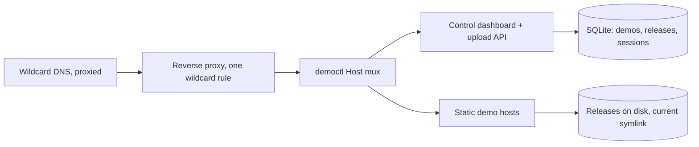

# Showroom

Self-serve static demo hosting on your own domain. Drag-and-drop a zip of a
built `dist/` folder and it is live on its own subdomain in seconds — no SSH,
no reverse-proxy tickets, no ops involvement per demo.

One Go binary with embedded SQLite. The binary and systemd service are named
`democtl`; "Showroom" is what it does — puts your work on display.

## How it works

A single listener multiplexed by the `Host` header:

- `demos.example.com` → the control dashboard: Google Workspace OAuth, demo
  list, zip upload, rollback, rename, delete.
- `` `<name>.example.com` `` → static serving of that demo's current release.
- anything else → a generic 404.



A deploy is a directory swap: the zip is validated, extracted to
`releases/<demo>-<ts>/`, and a new `current` symlink is renamed into place
atomically. The previous release is kept for one-click rollback. Exact-host
proxy rules keep precedence over the wildcard route, so existing hosts are
never touched.

## Upload pipeline

Uploads are hostile input. Every zip passes the guards below before any of
it touches disk, and extraction happens against a rooted filesystem handle
(`os.Root`), so path traversal is impossible by construction.

| Guard | Value |
| --- | --- |
| Zip size | 100 MB |
| Extracted total | 300 MB (zip-bomb guard, rejected mid-extract) |
| File count | 2,000 |
| Single file | 50 MB |
| Entry names | relative, no `..`, no backslashes, regular files only |
| Root marker | `index.html` at the zip root — it is a website or it is not |

Static serving then applies `Cache-Control: no-cache` to `index.html`,
immutable caching to content-hashed `/assets/*`, and an SPA fallback so
deep links work.

## Auth model

- Sign-in is Google OAuth restricted to your Google Workspace domain; both
  the `hd` claim and the email domain are verified server-side.
- The session cookie is host-only on the control host — demo sites are
  cross-origin and never see it.
- Every mutating request carries a per-session CSRF token.
- One role: any workspace member can manage any demo. Every action lands in
  an append-only JSONL audit log tied to the actor's Google identity.

## Quick start

Prerequisites: Go 1.24+ and Node (for the dashboard SPA build).

```bash
git clone https://github.com/kmmuntasir/showroom.git
cd showroom
(cd web && npm install && npm run build)  # dashboard -> web/dist, embedded
CGO_ENABLED=0 go build -o democtl .
```

Copy `.env.example` and fill it in (values only ever live in the env file on
the host, mode `0600`), then run `./democtl` — or install `democtl.service`
as a systemd unit with `EnvironmentFile=/etc/democtl/democtl.env`.

On the edge you need exactly two things: one proxied wildcard DNS record for
your domain, and one wildcard route in any reverse proxy pointing at the
listener. Demos appear at `https://<name>.your-domain.example` the moment a
deploy lands.

## Configuration

| Variable | Purpose |
| --- | --- |
| `DEMOCTL_LISTEN` | LAN-only listen address, e.g. `192.0.2.10:5000` |
| `DEMOCTL_CONTROL_HOST` | Dashboard hostname, e.g. `demos.example.com` |
| `DEMOCTL_BASE_DOMAIN` | Demo sites live at `` `<name>.<base>` `` |
| `DEMOCTL_DATA_DIR` | Demos, releases, upload staging (default `/srv/democtl`) |
| `DEMOCTL_DB_PATH` | SQLite database path |
| `DEMOCTL_AUDIT_PATH` | Append-only JSONL audit log path |
| `DEMOCTL_SESSION_KEY` | At least 32 bytes (`openssl rand -hex 32`) |
| `GOOGLE_CLIENT_ID` / `GOOGLE_CLIENT_SECRET` | OAuth web client credentials |
| `GOOGLE_WORKSPACE_DOMAIN` | Workspace domain, enforced at the callback |

## Layout

```
main.go                flags, wiring, graceful shutdown
internal/
  config/              env parsing + validation
  auth/                OAuth callback, sessions, CSRF
  server/              Host mux, control API, middleware
  serving/             static demo host: os.Root, cache headers, SPA fallback
  upload/              zip validation + extraction pipeline
  store/               SQLite, embedded migrations
  audit/               JSONL audit writer
  demonames/           label validation + reserved subdomains
web/                   React 19 + Vite dashboard (Chakra UI), embedded
democtl.service        systemd unit
.env.example           env template - names only, never real values
```

Subdomain labels must match
`^[a-z0-9]([a-z0-9-]{0,30}[a-z0-9])?$` and are checked against a reserved
blocklist (infra-generic names plus anything already deployed on the base
domain), so a demo can never shadow a real host.

## Tests

```bash
go test ./...
```

Handler tests run under `httptest` against a real SQLite database in a temp
dir; the crypto, upload validation, name, and auth paths are table-driven.
The suite never touches the network.

## License

GPL-3.0. See [LICENSE](LICENSE).
